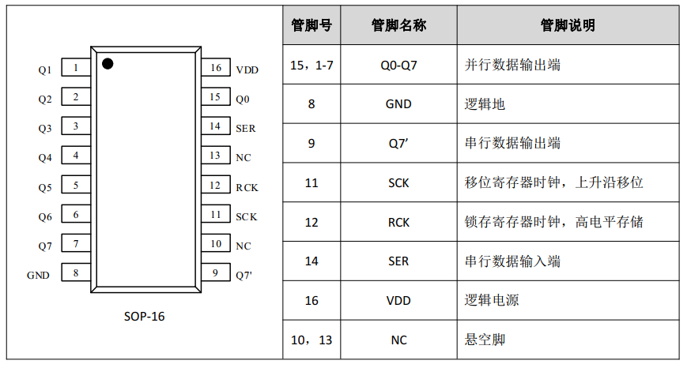
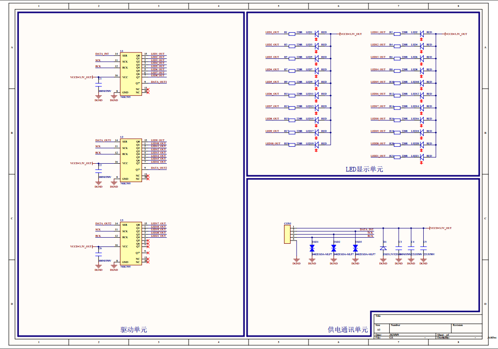
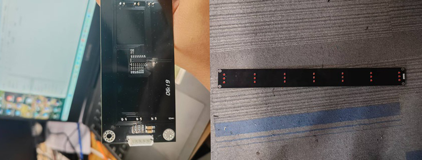

# <font size=3>一、工程介绍</font>
<font size=2>

该项目使用 `74HC595`芯片，该芯片是"8 位串入并出/三态锁存移位寄存器"，用 3 根 MCU 引脚就能扩展出 8 根（或多片级联时 N×8 根）并行输出口，常用于 LED、数码管、继电器等节省 IO 的场合。

</font>


# <font size=3>二、引脚功能</font>
<font size=2>

**74HC595 芯片引脚**
| 引脚 | 名称   | 功能说明（括号内为网络标号常见别名）                     |
| ---- | ------ | -------------------------------------------------------- |
| 15   | Q0     | 并行输出 bit0（最低位）                                  |
| 1–7  | Q1–Q7  | 并行输出 bit1–bit7                                       |
| 8    | GND    | 电源地                                                   |
| 9    | Q7′    | 串行级联输出，接下一片的 DS                              |
| 10   | /MR    | 主复位，低电平清移位寄存器（常接 VCC）                   |
| 11   | SHCP   | 移位时钟（SCLK, CLK）↑沿移入 1 bit                       |
| 12   | STCP   | 锁存时钟（RCLK, LATCH）↑沿把移位寄存器内容打入输出寄存器 |
| 13   | /OE    | 输出使能，低=输出有效，高=高阻（可接地）                 |
| 14   | DS     | 串行数据输入（DATA, SER）                                |
| 16   | VCC    | 2–6 V（常用 5 V 或 3.3 V）                               |


**74HC595D 芯片引脚**



</font>


# <font size=3>三、多片级联</font>
<font size=2>

第 1 片的 Q7′ 接到第 2 片的 DS，所有片子的 SHCP 并在一起，所有 STCP 并在一起。此时，MCU 仍然只需 3 根线。
需要注意的是，写数据时，先送“最远”的一片，最后送“最近”的一片，然后统一给一个 STCP 锁存脉冲即可。

</font>


# <font size=3>四、硬件电路</font>
<font size=2>

本次测试的硬件电路，采用三片`74HC595D`芯片进行级联，进而控制21个LED灯珠，本次硬件设计时，对`/OE`和`/MR`这两个引脚悬空处理，这个区别于`74HC595`芯片。

**如果`74HC595`芯片对这两个引脚悬空处理可能会有以下影响：**

**10 脚 /MR（Master Reset）悬空**
```bash
1. 低电平复位移位寄存器。悬空后极易受干扰而被“误复位”，结果 Q0-Q7 突然全灭

处理方法 ⇒ 直接接 VCC（或经 10 kΩ 上拉到 VCC），保证永远不复
```

**13 脚 /OE（Output Enable）悬空**
```bash
低电平才允许输出；悬空后随环境噪声在 0/1 之间漂，会导致：
1. LED 随机熄灭/闪烁
2. 输出高阻，MOS 管/继电器误动作

处理方法 ⇒ 直接接 GND（或经 1 kΩ 下拉到 GND），让输出一直有效；如果后面想“总线隔离”或 PWM 调光，就改由 MCU GPIO 控制，但绝不能浮空。
```
**MCU与74HC595连接**
| 引脚 | 名称   | 功能说明（括号内为网络标号常见别名）                     |
| ---- | ------ | --------------------------------------------------------|
| 11   | SCK    | 移位寄存器时钟， 上升沿移位                               |
| 12   | RCK    | 锁存寄存器时钟， 高电平存储                               |
| 14   | SER    | 串行数据输入端                                           |




实物图如下：


</font>


